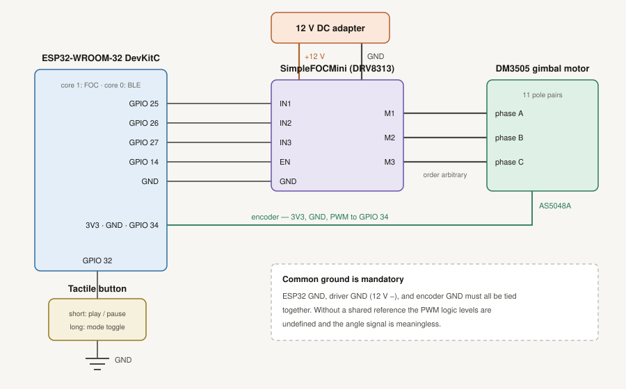

# Haptic Smart Knob

**A field-oriented-control BLDC drive with software-defined haptics and BLE HID media control.**

Turning the knob adjusts system volume or skips tracks. A tactile button plays/pauses and toggles
modes — and each mode reprograms the *feel* of the knob: fine 10° detents for volume, coarse 50°
detents with soft endstops for track skipping. Different torque field per mode with no hardware difference.

<!-- TODO: add demo GIF here — this is the single highest-impact asset on the page.

-->

---

The knob is the demonstration. The motor control stack underneath is the substance.

Detents don't come from a mechanical spring and ball — there is no mechanical detent anywhere in
this build. The knob is a 3-phase brushless motor running voltage-mode field-oriented control, and
every "click" you feel is a torque command computed in firmware from the rotor angle:

```
AS5048A ──► θe = p·θm − θ0 ──► haptic torque law ──► inverse Park ──► inverse Clarke ──► SVPWM ──► DRV8313 ──► motor
  (θm)         (p = 11)          (detent → Uq)         (dq → αβ)        (αβ → abc)      (25 kHz)
```

The stator voltage vector is placed exactly 90° electrical ahead of the rotor flux and held there
as the rotor turns — rotor-referenced sinusoidal commutation, the same architecture as an EV
traction inverter or a robot joint actuator, at milliwatt scale. The haptics are just an
application layer written on top of a torque-controlled axis: change the torque-vs-angle function
and you change the physical sensation, with no mechanical change at all.

---

## Torque map


Measured detent torque vs. shaft angle in both modes. Same motor, same firmware with the only difference being the torque shaping parameters. Volume mode uses fine 10° detents; track mode uses coarse 50° dead-zone detents that coast freely between positions. The haptic feel is entirely software-defined.

---

## How it works

### Torque field → feel

Each mode defines a periodic torque function of rotor angle. The controller runs in
voltage-torque mode (the SimpleFOCMini has no current sense), so the commanded quantity is a
q-axis voltage proportional to desired torque.

| Mode | Detent spacing | Endstops | HID output |
|---|---|---|---|
| **Volume** | 10° | none | Volume Up / Volume Down |
| **Track** | 50° | soft walls (`WALL = 1.5`) | Next Track / Previous Track |

Two refinements make it feel right rather than merely work:

- **Dead-zone detent profile.** Restoring torque is applied only inside a catch zone around each
  detent center, and the field is free in between. Without this, wide (50°) detents develop a
  spurious "dent" in the middle of the gap, because a pure sinusoidal torque profile has its
  strongest restoring force halfway between centers.
- **Directional hysteresis on event emission.** A detent index is only committed after the knob
  travels 60% of a step past the detent it is currently in. Coarse detents overshoot and settle,
  which was double-counting track skips — one skip on the overshoot, one on the bounce-back. The
  hysteresis is put in place to yield exactly one HID event per detent, with no early trigger and no bounce-back
  double-count.

### Two-core split

| Core | Task |
|---|---|
| **1** | FOC loop + haptic torque computation |
| **0** | BLE HID stack |

The two are joined by a **zero-timeout FreeRTOS queue**. If the BLE side blocks — a stalled
notification, a host that stopped acknowledging — the haptics never stall, because the producer
never waits on the queue. It's acceptable to drop a media event but a hitch in the torque loop is
immediately felt in the hand.

---

## Control architecture

"FOC" covers two separable halves, and this build implements one of them.

**What is closed: field orientation.** The rotor's electrical angle is measured every loop
(`θe = 11·θm − 0.82`), and the stator voltage vector is placed 90° electrical ahead of the rotor
flux via inverse Park with `Ud = 0`. That is genuine rotor-referenced sinusoidal commutation —
the geometric content of FOC.

**What is open: current regulation.** The DRV8313 carrier has no current sense, so there is no
forward Clarke/Park on measured currents and no PI loop on `id`/`iq`. The firmware commands a
q-axis *voltage* and lets the winding decide the current:

```
                             ┌─ absent: i_abc → Clarke → Park → PI(id, iq) ─┐
                             ╵                                              ╵
   θe ──► torque law ──► Uq ──► inverse Park ──► inverse Clarke ──► SVPWM ──► inverter
```

This is standard practice for gimbal-motor haptics, and it is defensible here for a specific
reason. At steady state a phase obeys `Uq = iq·R + L·diq/dt + Ke·ωm`. On a knob the rotor barely
moves, so back-EMF is negligible and the inductive term is zero at DC, leaving:

```
iq ≈ Uq / R        τ ≈ (Kt / R) · Uq
```

Torque tracks commanded voltage. Two consequences follow, both real and both measurable:

- **Torque droops with speed.** Back-EMF reaches 25% of the 4 V command at roughly 12.5 rad/s
  (≈2 rev/s) — within reach of a brisk flick. A current loop would reject this by raising `Uq`;
  this one cannot.
- **Torque drifts with temperature.** Copper resistance rises ~0.4%/°C, so a 60°C winding rise
  costs ~24% of torque with no compensation. The torque *constant* is stable; the torque is not.

The accurate description is **voltage-mode FOC** (equivalently, open-loop-current FOC). Closing
the current loop would need shunts or in-line sensors on two phases plus PWM-synchronous sampling
— a hardware change, not a firmware one.

---

## Key design decisions

**1. Integrated-encoder motor, to delete the biggest mechanical risk.**
The dominant failure mode in DIY FOC builds is the air-gap alignment between the diametric-magnet and the encoder. The
ROB-27478 ships with the AS5048A factory-aligned to the rotor. This ensures that there's no human error in this part of the build.

**2. The encoder was PWM, not SPI — and that shaped the whole control design.**
The AS5048A supports both, but this unit only breaks out the PWM output. Using `MagneticSensorPWM`
caps angle updates at roughly 1 kHz and makes the differentiated velocity estimate noisy. That
single interface constraint drove decision 3.

**3. Damping was removed after measurement, not after taste.**
A `−DAMP · velocity` term is the textbook way to settle a haptic detent. Here it made the knob
oscillate *worse*. The velocity signal is a finite difference of a ~1 kHz quantized angle, so the
damping term was injecting noise-driven torque faster than it removed energy. Endstops were kept
soft for the same reason. This is an interface-bandwidth limitation, not a tuning failure — the fix
is an SPI encoder, not a different gain.

**4. Undocumented motor wiring, reverse-engineered with a DMM.**
The phase leads terminate in bare surface pads with no markings. Measuring ~6.8 Ω between three
pads identified them as the phase windings (datasheet: 6.34 Ω phase-to-phase; the excess is lead
and probe resistance). The phase wires were soldered directly to the surface pads.

**5. BLE HID over the Spotify Web API, deliberately.**
HID gives roughly 15 ms end-to-end latency versus 100–300 ms for a cloud round-trip, and needs no
OAuth, TLS, or WiFi provisioning. For a device whose entire value is that it feels physically
connected to the audio, latency wins. The documented cost: HID is write-only, so there is **no
state readback and therefore no true volume endstops** — the firmware cannot know where the host's
volume actually is. See [Known limitations](#known-limitations).

---

## Characterization

Measured on an Analog Discovery 2.

### Phase PWM — switching frequency


Two inverter phase outputs, 10 µs/div, 5 V/div. Measured switching frequency
**24.998 kHz and 25.009 kHz** on the two channels — matching the configured ~25 kHz PWM carrier,
above the audible band so the drive is silent. Both phases swing the full 12 V rail with clean
edges and no visible shoot-through notch, and the two channels sit at visibly different duty
cycles at this instant, which is the commutation acting on the two phases independently.

<!-- TODO: phase envelope figure — see analysis/README.md for the recapture procedure.
Note when writing the caption: measured phase-to-ground, SVPWM produces a saddle-shaped
envelope, not a sinusoid, because the third-harmonic common-mode injection that buys 15.5%
extra fundamental amplitude cancels only differentially. Plot C1 − C2 for the sinusoid.

-->

<!-- TODO: current → torque figure (1 Ω shunt; τ = 0.08 N·m/A × I)

-->

<!-- TODO: step response (serial-logged) -->

---

## Hardware

| Block | Part | Notes |
|---|---|---|
| Motor | SparkFun ROB-27478 (**DM3505**) gimbal, 12 V | 11 pole pairs |
| Encoder | **AS5048A**, PWM output | On-motor, factory-aligned |
| Driver | SimpleFOCMini (**DRV8313**) | 8–30 V, 2.5 A/phase, no current sense |
| MCU | ESP32-WROOM 30-pin DevKitC (CP2102, USB-C) | Dual-core, BLE |
| Button | 6×6 mm tactile | Short press = play/pause, long = mode toggle |
| Power | 12 V adapter → driver; ESP32 via USB | |

**DM3505 motor specs:** 12 V / 1.1 A nominal, 1.9 A stall, phase-to-phase R = 6.34 Ω,
L = 1.08 mH, torque constant 0.08 N·m/A, 11 pole pairs.

Full pin map:  · Bill of materials:
[`hardware/BOM.csv`](hardware/BOM.csv)


---


## Known limitations

- **No true volume endstops.** BLE HID is write-only. The firmware sends Volume Up/Down keycodes but has no knowledge of  the host's actual volume level, so it cannot place a hard wall at 0% or 100%. Changing the volume through another method would throw off predetermined walls/Track mode has real endstops because its range is defined locally, not by the host.
- **Velocity feedback is not usable for control.** The PWM encoder interface (~1 kHz, quantized)
  makes differentiated velocity too noisy for damping. Detent settling is therefore underdamped
  compared with an SPI-encoder build.
- **No current sensing.** Torque is commanded as a q-axis *voltage* rather than regulated as a
  current, so it varies with winding temperature and back-EMF. A 1 Ω shunt measurement would resolve the actual current and torque figures.
- **Breadboard construction**, with the ESP32 powered separately over USB.

---

## License

MIT — see [LICENSE](LICENSE).
